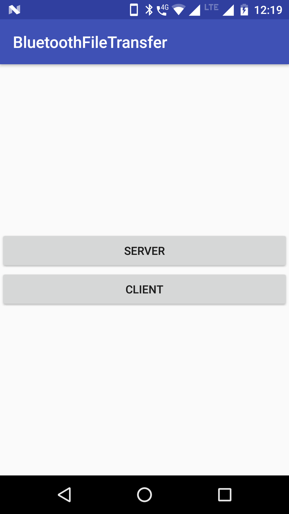
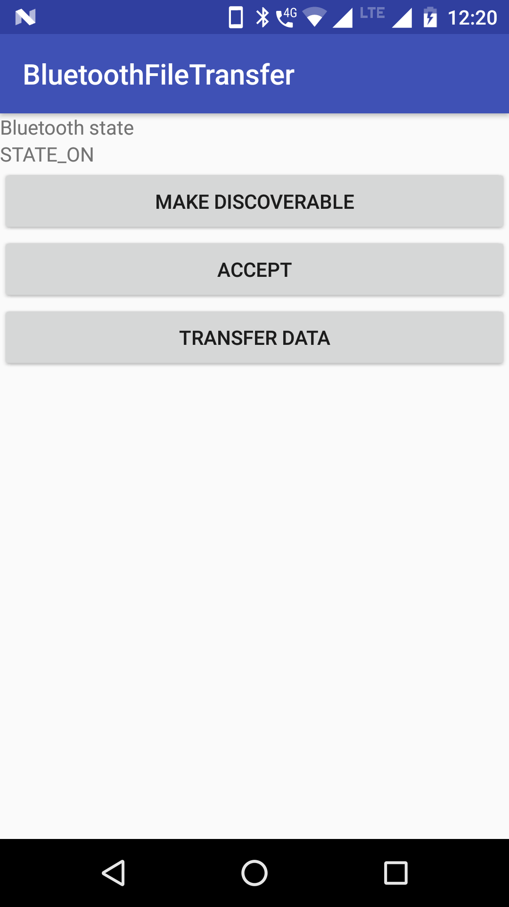
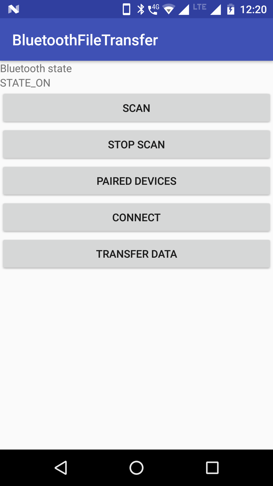

A simple app to showcase data transfer using Bluetooth.

How to use:
1. Firstly, you need two android devices with bluetooth support.
2. From Main menu choose `SERVER` option on one device and `CLIENT` in another.

FOR `SERVER` :
1. Click `MAKE DISCOVERABLE`.
2. Click `ACCEPT`.

For `CLIENT` :
1. Click `SCAN`.
    A list of available devices will be shown

Main Activity 

Server 

Client 

