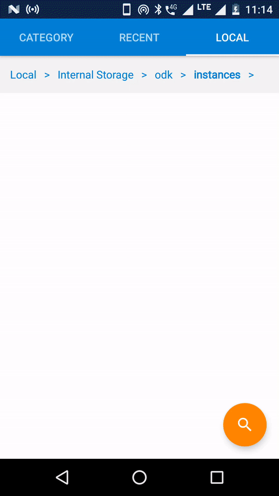

A simple app to showcase data transfer using Bluetooth.

How to use:
1. Firstly, you need two android devices with bluetooth support.
2. From Main menu choose `SERVER` option on one device and `CLIENT` in another.

FOR `SERVER` :
1. Grant permissions if asked.
1. Click `SERVER` button form main screen.
3. A prompt will appear to make device discoverable. Click `Allow` button.
4. Wait for client device to connect.

For `CLIENT` :
1. Grant permissions if asked.
1. Click `CLIENT` button form main screen.
2. Choose the device you want to connet to. (Click on name of device).
3. Click `CONNECT`.

If connection is successful, a screen with `RECEIVE` and `SEND` button will appear. 

Server -> Client

    

